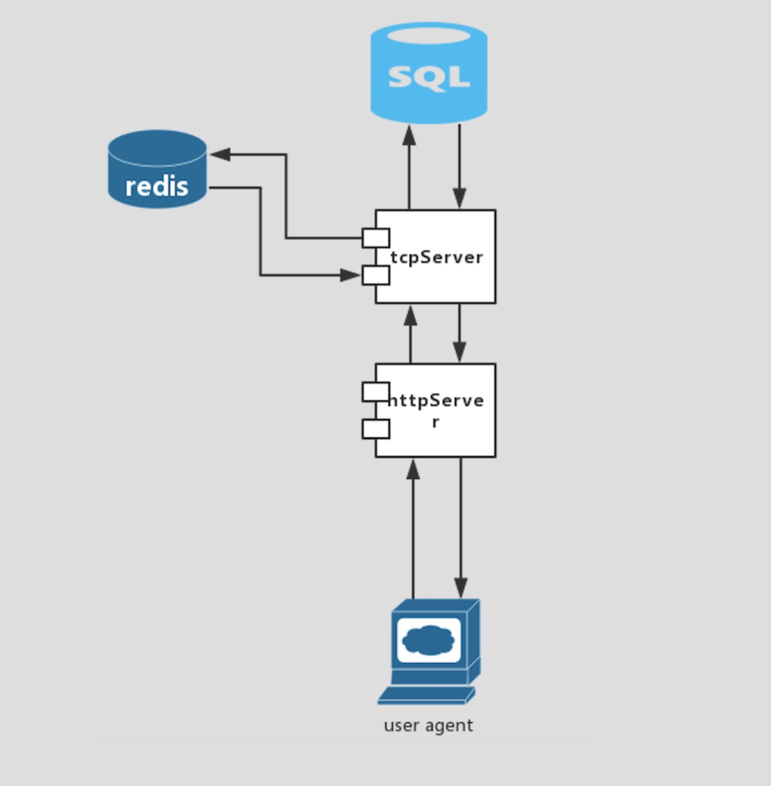
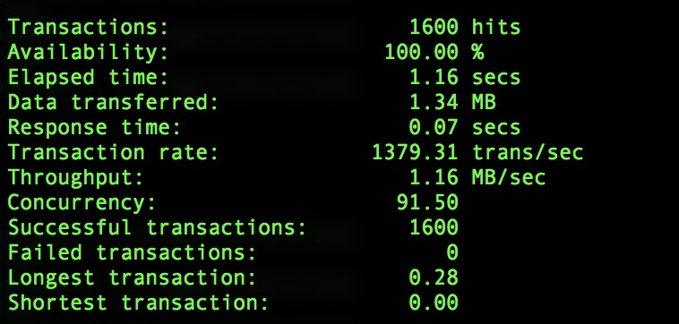

# Design 

>* HttpServer receives http requests and transfer the parameters to tcpServer, tcpServer check the data in request such as if password is correct and query redis and mysql database. Users data store in mysql, if there is cache in redis, tcpServer will use cache first. Just like chart below.



# Installation and maintenance documentation

### Source code
```
git clone https://github.com/hiramwang/entry_task.git
```
### Necessary Components
> * [Mysql Server Download](https://dev.mysql.com/downloads/)
> * [Redis Server Download](http://redis.io)
> * Go-mysql driver : https://github.com/go-sql-driver/mysql
> * Go-Redis driver : https://github.com/go-redis/redis

### Files Structure

```
entry_task
    | - - make.sh
    | - - Readme.md
    | - - bin
    | - - log  // server logs are written here
    | - - logbak
    | - - photo // store photos of users
    | - - src
           | - - main.go
           | - - httpServer
           | - - tcpServer  // include mysql,redis apis
           | - - templates  // html code
           | - - test       // Stress testing materials
           | _ _ conf       // include settings and logger
``` 

### Settings
> Settings are in src/conf/setting.go, change the redis and mysql configs if they are different with yours.
```
var (                               
    TemplatePath = "/src/templates/"                      
    PhotoPath    = "/photo"                              
    HttpAddr     = "127.0.0.1:8888"                        
    TcpAddr      = "127.0.0.1"                           
    TcpPort      = ":8880"                               
    RedisAddr    = "127.0.0.1:6379"                       
    RedisPass    = ""                                
    MysqlUser    = "hiram"                                   
    MysqlPass    = "hiram"                                   
    MysqlDB      = "mysql"
    MysqlTable   = "shopee_test"                                    
)     
```

### How do start

```
Install mysql and redis servers, and start them.

Change settings to yours (vim src/conf/setting.go)

git clone https://github.com/hiramwang/entry_task.git && cd entry_task && make.sh

./bin/entry_task

Ok, start using it by browser or curl
```

### APIs

| Uri |method| parameters | tips |
| --------   | --- | ----- | ---- |
|index|Get|none|index page, you can login or register here|
|login|Ge|account&password| check password and login |
|register|Get|account&password&nickname|create a new account|
|changeName|Get|account&nickname| change your nickname|
|ChangePhoto|Post|account&photo|change your photo|

### Response error types

```
var ErrType map[string]string = map[string]string{
    "":     "default error",
    "4000": "Request parse fail, check your request",
    "4001": "Account does not exist, you must have parameter account",
    "4002": "Password invalid, wrong password, try again",
    "4003": "Nickname invalid, parameters need to have nickname",
    "5001": "rpc server error",
    "5002": "httpserver error",
}  
```
### Logs
> You can watch the server running logs in folder "log" which is in the equal file path with make.sh. There are four kind of logs, include debug, trace, warn and error. Debug log is used for debuging, ordinary logs like request logs are in trace log, server's fatal errors are loged in error log. 

### Function Testing
> There are some function testing files in the project. In order to ensure tcp-server and mysql-driver run correctly. You can see them in "src/tcpServer/mysql_test.go" and "src/tcpServer/tcpServer_test.go". They both use standerd testing lib of golang.Just use the commend below to run the tests and get result in console.

```
cd src/tcpServer && go test
```

# Performance testing

### Tools and materials
>  There are many http request testing tools, like siege, ab and so on. I use both two tools. Becasue ab do better than siege on concurrent http requests, but siege can send random different requests to simulate different user login. I prepared test file with 1 thousands http requests for diffirent user。


#### concurrent testing
```
ab -c 1000 -n 10000 "http://127.0.0.1:8888/login?account=hiram521&password=hiramwang"
```


#### Different user request testing
```
siege -c 200 -t 1600 -f testUrl_1000
```
> * test with out cache:



> * test with cache:


#### tips
> change system limits before run server such as open files limit, it can help server recepts more request. And the code below can help go server takes the maximum number of CPUs that can be executing.
```
runtime.GOMAXPROCS(runtime.NumCPU())
```

# Concluding

>* This entry task makes me learn how to use golang to create http and tcp server, and build a simple system with mysql and redis. This project can meet the requirements that are listed. But there are still many things could be done, include web UI, authentication security, performance promotion, http interaction standardizing, function testing.


---


